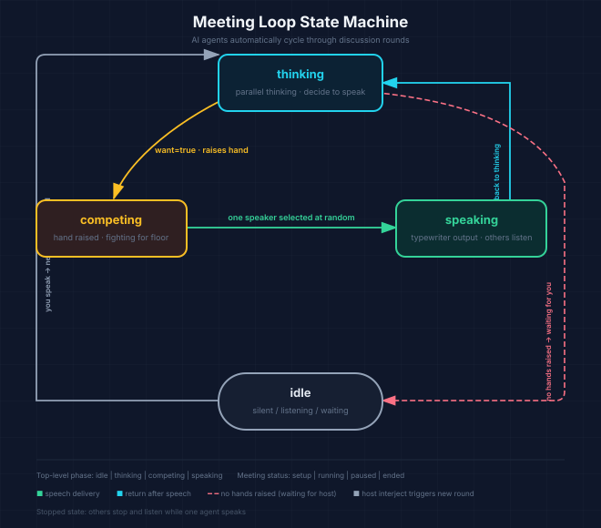

# Seat · Roundtable

[中文版](README.md)

&gt; Let AI Agents take the place of your colleagues and have meetings with you.

You are the host and a permanent participant — "You." Create a meeting, pick AI characters from the roster — Product Manager, Tech Lead, Designer, Marketing Lead, and more — and take your seats. Once the meeting starts, all AI agents automatically drive the discussion in a loop: **think → raise hand &amp; compete for floor → one speaks → repeat**. You can jump in at any time.

## Features

- **Realistic meeting loop**: AI agents think in parallel, raise hands to compete for the floor; a random "winner" speaks typewriter-style while others stop and listen. When nobody speaks, the system waits for you.
- **Character roster**: Persistent character library with group management. Each character has a name, role, personality, speaking style, background, and an auto-colored avatar.
- **Four inference engines**: Demo mode works out of the box; Local Agent calls your local `claude` / `codex` CLI; Cloud LLM connects directly to OpenAI-compatible / Anthropic APIs; Hosted AI requires no API key — just log in and go.
- **Multiple providers**: Create multiple named providers; each AI agent can bind to a different provider independently — different characters can use different models without interference.
- **Accounts &amp; subscriptions**: Email magic link / Google login; free trial with 20k tokens; Pro plan gives 2 million tokens/month (Lemon Squeezy payment), with a real-time quota bar. After login, character library and engine settings sync to the cloud via `/api/data`.
- **Zero-dependency local mode**: Without logging in, all local features work; data is stored in `localStorage`.

## Meeting Loop (State Machine)

A meeting progresses through a loop. At any moment, each character is in one of the following states:

| Character State | Meaning |
|---|---|
| `idle` | Silent / listening |
| `thinking` | Parallel thinking: deciding "do I have something to say?" — raises hand if yes |
| `competing` | Hand raised, competing for the floor lock |
| `speaking` | Won the floor, speaking typewriter-style |
| `stopped` | Someone else is speaking, stopped to listen |

Top-level phase: `idle | thinking | competing | speaking`; Meeting status: `status: setup | running | paused | ended`.



- After thinking, each AI agent returns JSON `{"want": true/false, "say": "..."}`; among those who raised hands, **one is selected at random** to win the floor. If no one raises a hand, the round ends and the system waits for you to speak.
- You (the human) are always in the meeting and can type anytime; after you speak, all AI agents enter a new thinking round.

The UI uses a "phase indicator bar + character roster status badges + floor lock chip" to convey the current situation at a glance: who's thinking, who raised a hand, who got the floor.

## Quick Start (Demo Mode, Zero Config)

By default the app runs in Local Agent mode, calling your local CLI via the bridge service — no account or cloud key required:

```bash
npm run dev        # Starts local bridge and static hosting, default http://127.0.0.1:5174/
```

You can also open `meeting-simulator.html` with any static server (Local Agent mode requires the bridge to be running; Cloud LLM requests are also proxied through the bridge by default to avoid CORS issues).

## Usage Flow

1. **Meeting setup**: Fill in the meeting title, agenda, and background (you can paste screenshots, links, PDFs, and text files — drag-and-drop or click "Add attachment") → Select attending characters from the roster → Optionally enable "Deep thinking" → Click "Start meeting."
2. **In-meeting (core view)**: Top bar shows title / status pill / phase indicator / floor lock chip; the side roster shows real-time status badges for each character; the central message stream renders AI speech with a typewriter effect, system messages are centered; the bottom input box lets you speak as "You" at any time (Enter to send, Shift+Enter for newline; paste screenshots, drag files, or click the paperclip to attach).
3. **Wrap up conclusions**: After pausing or ending the meeting, a "Summarize conclusions" button appears in the top bar. It calls the engine to generate structured conclusions based on the full transcript (including attachments), supports copying and re-summarizing; conclusions are persisted with the session.
4. **Character library management**: Left sidebar for groups (create / rename / delete), right side for character grid; click a character card to open an edit panel (name, role, group, inference provider, personality, speaking style, background, avatar color).

## Inference Engines

AI speech is driven by an "inference engine." There are 3 modes, selectable in the "Configure inference engine" dialog; you can create multiple named providers and assign them per character:

| Mode | Description | Prerequisites |
|---|---|---|
| `local` Local Agent (default) | Calls your locally logged-in `claude` / `codex` CLI (via `bridge.mjs`) | CLI installed &amp; logged in locally, bridge running |
| `cloud` Cloud LLM | Direct connection to OpenAI-compatible / Anthropic APIs | Your own Base URL + API Key |
| `hosted` Hosted AI | Proxied through the product's OpenAI calls, no key needed | Logged-in account + quota (free 20k / Pro 2M tokens/month) |

Attachment capabilities: Screenshots (images) are recognized by all engines (requires multimodal model); PDFs are only supported by local Claude and the Anthropic protocol; links and text files are sent as text with the context and work with all engines. Unsupported combinations are explicitly flagged before sending/starting — never silently ignored.

## Project Structure

```
meeting-simulator.html     Frontend single-file (setup / meeting / library views + all inline CSS/JS)
bridge.mjs                 Local bridge server: /health /agent /llm + static hosting (binds to 127.0.0.1 only)
server.mjs                 VPS long-running Node entry (zero extra deps; not needed for Vercel deployment)
api/                       Backend functions (shared between Vercel Serverless and VPS)
  ├── chat.js              Hosted inference: auth → quota check → OpenAI call → usage billing
  ├── billing.js           Plan and quota queries
  ├── subscribe.js         Create Lemon Squeezy checkout link
  ├── data.js              Cloud sync for user data (character library / selections / engine &amp; provider config)
  ├── config.js            Public config (exposes only browser-safe info, no secrets)
  ├── health.js            Health check
  └── webhook/lemonsqueezy.js   Subscription event webhook (signature verification)
lib/                       Server utilities (supabase / usage / lemonsqueezy / config / http)
sql/schema.sql             Supabase database schema (subscriptions / usage / user_data + atomic increment function)
vercel.json                Vercel: rewrites all non-/api paths to the single-file frontend
.env.example               Environment variable template
README-deploy.md           Deployment guide (Supabase / OpenAI / Lemon Squeezy / Vercel / VPS)
ojo-design/                Upstream design system (visual specs, see its README)
```

## API Reference

| Endpoint | Method | Description | Auth |
|---|---|---|---|
| `/api/health` | GET | Health check | None |
| `/api/config` | GET | Public config (Supabase URL / anon key / plan quotas) | None |
| `/api/chat` | POST | Hosted inference + usage metering, returns 402 when quota exhausted | Logged-in user |
| `/api/billing` | GET | Plan, quota, usage, subscription status | Logged-in user |
| `/api/data` | GET / PUT | Cloud sync for user data (character library, etc.) | Logged-in user |
| `/api/subscribe` | POST | Create Lemon Squeezy checkout link | Logged-in user |
| `/api/webhook/lemonsqueezy` | POST | Subscription event webhook (signature verification) | LS signature |

&gt; Anonymous guests cannot call account-related endpoints (`requireUser` returns 401 for `is_anonymous` JWT). Data for non-logged-in users is stored locally in `localStorage` only.

## Local Development

```bash
npm install             # Only needs @supabase/supabase-js (for backend)
npm run dev             # Bridge service (Local Agent / Cloud LLM modes), http://127.0.0.1:5174/
npm start               # Pure Node backend + static page (with /api, reads .env), http://localhost:3000
npm run vercel:dev      # Vercel CLI for local frontend + /api
```

Bridge endpoints: `GET /health` checks service and local agent CLI availability; `POST /agent` calls `claude` / `codex` (prompt via stdin); `POST /llm` proxies cloud LLM requests. The bridge binds to `127.0.0.1` only and does not accept external traffic.

## Deployment

For the full deployment flow (Supabase login &amp; database, OpenAI, Lemon Squeezy subscriptions, Vercel / VPS, end-to-end verification, go-live checklist), see **[README-deploy.md](./README-deploy.md)**.

Environment variables are filled in per [.env.example](./.env.example): `SUPABASE_URL` / `SUPABASE_ANON_KEY` / `SUPABASE_SERVICE_ROLE_KEY`, `OPENAI_API_KEY`, `LEMONSQUEEZY_*`; optionally `FREE_QUOTA_TOKENS` / `PRO_QUOTA_TOKENS` (default 20k / 2 million).

## Tech Stack

- **Frontend**: Single-file HTML + inline CSS/JS (oklch warm design tokens, rounded cards, character status badges, typewriter rendering)
- **Backend**: Vercel Serverless functions (or `server.mjs` as a long-running Node process, same handler code)
- **Services**: Supabase (email magic link / Google login + Postgres), OpenAI (hosted inference), Lemon Squeezy (subscription payments)

## UI Design

UI design proposals and improvement discussions can be found in [ui-design-prompt.md](./ui-design-prompt.md); upstream visual specs are in `ojo-design/`.
