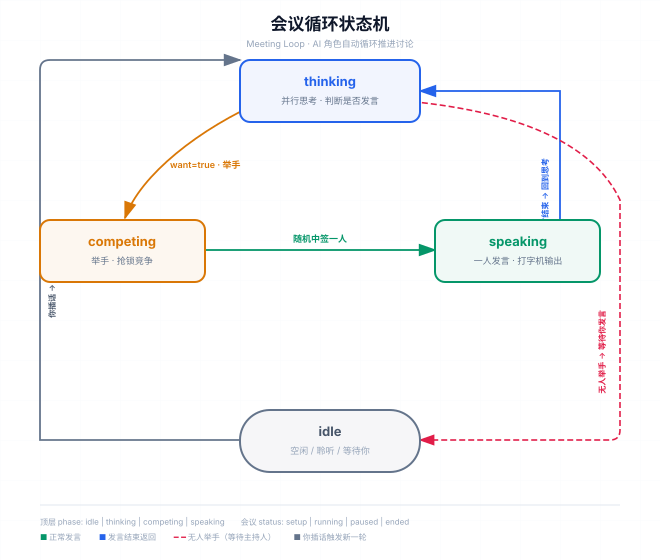

# 圆桌会 · Seat 一席

> 多角色 AI 会议模拟 —— 和一群立场、性格各异的 AI「同事」开会，推演决策、预演评审、头脑风暴。

你是主持人，也是固定参会者「你」。创建一场会议，从角色库里挑选产品经理、技术负责人、设计师、市场负责人等 AI 角色入席；会议开始后，所有 AI 角色自动循环推进讨论——**思考 → 举手抢发言权 → 一人发言 → 循环**，你可以随时插话参与。

## 特性

- **真实的会议循环**：AI 角色并行思考、举手竞争发言权、随机中签者打字机式发言，其余角色停下聆听；无人发言时系统等待你发声。
- **角色库**：可持久化的角色集合，支持分组管理；每个角色有姓名、职责、性格、说话风格、背景与自动配色的头像。
- **四种推理引擎**：演示模式开箱即用；本地 Agent 调用本机 claude / codex CLI；云端 LLM 直连 OpenAI 兼容 / Anthropic 接口；托管 AI 免填 Key、登录即用。
- **多底座（Provider）**：可创建多个命名底座，每个 AI 角色可单独绑定一个底座——不同角色用不同模型，互不影响。
- **账号与订阅**：邮箱魔法链接 / Google 登录；免费试用 20k tokens，Pro 每月 200 万 tokens（Lemon Squeezy 支付），额度条实时可见；登录后角色库、引擎配置经 `/api/data` 云端同步。
- **零依赖本地运行**：未登录时全部本地功能可用，数据存 `localStorage`。

## 会议循环（状态机）

一场会议的推进是一个循环，每个角色在任意时刻处于以下状态之一：

| 角色状态 | 含义 |
|---|---|
| `idle` | 空闲 / 聆听 |
| `thinking` | 并行思考：判断「我有没有话要说」，有话要说就举手 |
| `competing` | 已举手，进入抢锁竞争 |
| `speaking` | 获得发言权，打字机式逐字输出 |
| `stopped` | 他人发言中，停下聆听 |

顶层阶段 `phase: idle | thinking | competing | speaking`；会议状态 `status: setup | running | paused | ended`。



- 每个 AI 角色思考后返回 JSON 决定 `{"want": true/false, "say": "..."}`；多个举手者中**随机**一人赢得发言权；无人举手则本轮结束，系统提示等待你发言。
- 你（真人）始终参会，随时输入发言；发言后触发所有 AI 角色进入新一轮思考。

界面用「阶段指示条 + 角色名册状态徽章 + 发言锁芯片」协同表达当前局面：谁在思考、谁举手了、谁拿到了发言权。

## 快速开始（演示模式，零配置）

默认使用本地 Agent 模式，经桥接服务调用本机 CLI，不需要账号或云端 Key：

```bash
npm run dev        # 启动本地桥接并静态托管页面，默认 http://127.0.0.1:5174/
```

也可以用任意静态服务器打开 `meeting-simulator.html`（本地 Agent 模式需桥接服务运行；云端 LLM 模式请求同样优先经桥接转发以规避跨域）。

## 使用流程

1. **会议设置**：填写会议标题、议题、背景（均可附加截图、链接、PDF、文本文件——直接粘贴截图/链接、拖入或点「添加附件」）→ 从角色库勾选本次参会角色 → 可选开启「深度思考」→ 「开始会议」。
2. **开会（核心界面）**：顶部栏为标题 / 状态胶囊 / 阶段指示条 / 发言锁芯片；侧边名册实时显示每个角色的状态徽章；中央消息流以打字机效果呈现 AI 发言，系统消息居中；底部输入框以「你」的身份随时发言（回车发送，Shift+回车换行；可粘贴截图、拖入文件或点回形针添加附件）。
3. **整理结论**：暂停或结束会议后，顶栏出现「整理结论」按钮，基于完整纪要（含附件）调用引擎生成结构化结论，支持复制与重新整理，结论随会话持久化。
4. **角色库管理**：左侧分组栏（新建 / 重命名 / 删除分组），右侧角色网格，点击角色卡片弹出编辑窗（姓名、职责、分组、推理底座、性格、说话风格、背景、头像颜色）。

## 推理引擎

AI 发言由「推理引擎」驱动，共 3 种模式，可在「配置推理引擎」弹窗中选择，并可建立多个命名底座按角色分配：

| 模式 | 说明 | 前置条件 |
|---|---|---|
| `local` 本地 Agent（默认） | 调用本机已登录的 claude / codex CLI（经 `bridge.mjs` 桥接） | 本机已安装并登录 CLI，桥接运行中 |
| `cloud` 云端 LLM | 直连 OpenAI 兼容 / Anthropic 接口 | 自备 Base URL + API Key |
| `hosted` 托管 AI | 由产品方代理调用 OpenAI，免填 Key | 登录账号 + 额度（免费 20k / Pro 200 万 tokens·月） |

附件能力：截图（图片）所有引擎都可识别（需多模态模型）；PDF 仅本地 claude 与 Anthropic 协议支持；链接与文本文件作为文本随上下文发送，所有引擎通用。不支持的组合会在开会 / 发送前明确提示，不会静默忽略。

## 项目结构

```
meeting-simulator.html     前端单文件（设置 / 会议 / 角色库三个视图 + 全部内联 CSS/JS）
bridge.mjs                 本地桥接服务：/health /agent /llm + 静态托管（仅绑定 127.0.0.1）
server.mjs                 VPS 长驻 Node 入口（零额外依赖；Vercel 部署不需要）
api/                       后端函数（与 Vercel Serverless / VPS 共用同一套 handler）
  ├── chat.js              托管推理：鉴权 → 查额度 → 调 OpenAI → 记账
  ├── billing.js           套餐与额度查询
  ├── subscribe.js         创建 Lemon Squeezy 结账链接
  ├── data.js              用户数据云同步（角色库 / 勾选 / 引擎与底座配置）
  ├── config.js            公开配置（仅暴露浏览器所需的最小信息，不含密钥）
  ├── health.js            健康检查
  └── webhook/lemonsqueezy.js   订阅事件回调（验证签名）
lib/                       服务端工具（supabase / usage / lemonsqueezy / config / http）
sql/schema.sql             Supabase 数据库结构（subscriptions / usage / user_data + 原子累加函数）
vercel.json                Vercel：所有非 /api 路径重写到单文件前端
.env.example               环境变量模板
README-deploy.md           部署手册（Supabase / OpenAI / Lemon Squeezy / Vercel / VPS）
ojo-design/                上游设计系统（视觉规范，参考其 README）
```

## API 一览

| 端点 | 方法 | 说明 | 鉴权 |
|---|---|---|---|
| `/api/health` | GET | 健康检查 | 无 |
| `/api/config` | GET | 公开配置（Supabase URL / anon key / 套餐额度） | 无 |
| `/api/chat` | POST | 托管推理 + 用量记账，额度耗尽返回 402 | 登录用户 |
| `/api/billing` | GET | 套餐、额度、已用量、订阅状态 | 登录用户 |
| `/api/data` | GET / PUT | 角色库等用户数据的云端同步 | 登录用户 |
| `/api/subscribe` | POST | 创建 Lemon Squeezy 结账链接 | 登录用户 |
| `/api/webhook/lemonsqueezy` | POST | 订阅事件回调（签名验证） | LS 签名 |

> 匿名游客禁止调用账号类接口（`requireUser` 对 `is_anonymous` JWT 一律 401），未登录用户数据仅存本机 `localStorage`。

## 本地开发

```bash
npm install             # 仅需安装 @supabase/supabase-js（后端用）
npm run dev             # 桥接服务（本地 Agent / 云端 LLM 模式），http://127.0.0.1:5174/
npm start               # 纯 Node 后端 + 静态页面（含 /api，读 .env），http://localhost:3000
npm run vercel:dev      # Vercel CLI 本地起前端 + /api
```

桥接接口：`GET /health` 检测服务与本机 agent CLI 可用性；`POST /agent` 调用 claude / codex（stdin 传 prompt）；`POST /llm` 转发云端 LLM 请求。桥接仅绑定 `127.0.0.1`，不接受外网访问。

## 部署

完整部署流程（Supabase 登录与数据库、OpenAI、Lemon Squeezy 订阅、Vercel / VPS、端到端验证、上线检查清单）见 **[README-deploy.md](./README-deploy.md)**。

环境变量按 [.env.example](./.env.example) 填写：`SUPABASE_URL` / `SUPABASE_ANON_KEY` / `SUPABASE_SERVICE_ROLE_KEY`、`OPENAI_API_KEY`、`LEMONSQUEEZY_*`，可选 `FREE_QUOTA_TOKENS` / `PRO_QUOTA_TOKENS`（默认 20k / 200 万）。

## 技术栈

- **前端**：单文件 HTML + 内联 CSS/JS（oklch 暖色系设计 tokens、圆角卡片、角色状态徽章、打字机渲染）
- **后端**：Vercel Serverless 函数（亦可 `server.mjs` 长驻 Node 进程，同一套 handler）
- **服务**：Supabase（邮箱魔法链接 / Google 登录 + Postgres）、OpenAI（托管推理）、Lemon Squeezy（订阅支付）

## 界面设计

界面设计方案与改进讨论见 [ui-design-prompt.md](./ui-design-prompt.md)，上游视觉规范参考 `ojo-design/`。